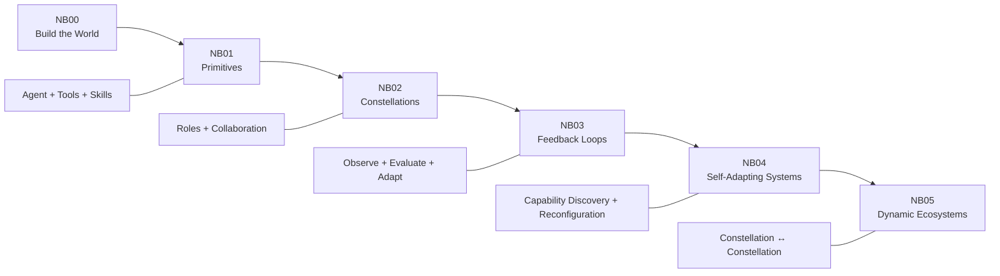
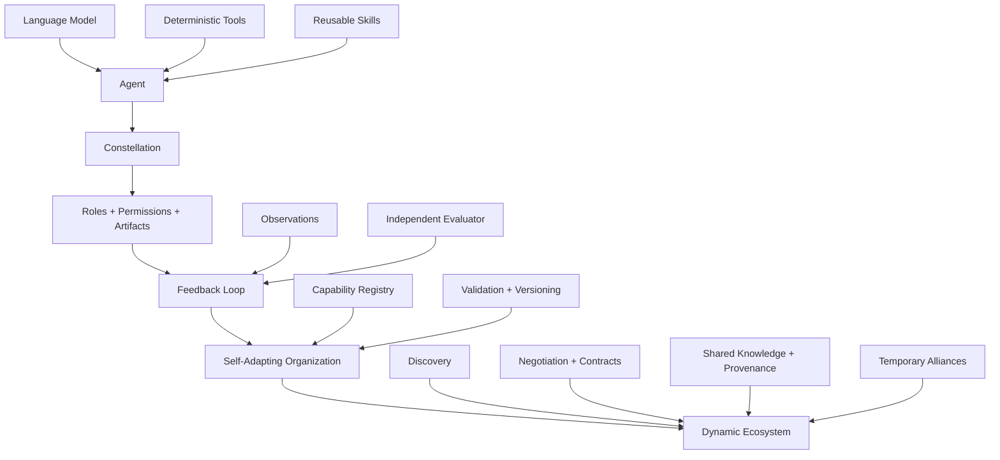

# AI in Finance: From Agents to Ecosystems

### A step-by-step tutorial for building agentic systems from first principles


**AI in Finance: From Agents to Ecosystems** is a deliberately cumulative tutorial on how to build agentic systems from the ground up.

The repository begins with the smallest useful primitives—**agents, tools, and skills**—and then progressively introduces **specialization, collaboration, feedback, adaptation, organizational reconfiguration, inter-constellation discovery, negotiation, shared knowledge, temporary alliances, and dynamic ecosystems**.

The central pedagogical idea is simple:

> **Do not begin with a complex autonomous architecture as a black box. Build agency one layer at a time, make every transition visible, and let each notebook answer one new systems question.**

The result is a finance-centered laboratory for understanding how increasingly sophisticated forms of autonomy can be engineered from simple, inspectable components.

---

## The pedagogical ladder

The tutorial follows a six-notebook sequence. Notebook 0 constructs the world. Notebooks 1–5 then climb the agentic ladder.



The conceptual progression is:

**Environment → Agency → Organized Cognition → Feedback → Self-Organization → Ecosystem Coordination**

At each stage, the system gains a qualitatively different capability.

| Stage | New capability | Core question |
|---|---|---|
| **NB00 — Environment** | A coherent synthetic financial world | What must exist before an agent can act meaningfully? |
| **NB01 — Primitives** | One agent can act through deterministic tools and a reusable skill | How does an individual agent acquire the ability to act? |
| **NB02 — Constellations** | Multiple specialized agents collaborate under explicit roles | How can several agents work as one system? |
| **NB03 — Loops** | The system observes changes, evaluates outcomes, and adapts | How can an agentic system respond to what happens after it acts? |
| **NB04 — Self-Adapting Systems** | The system changes its own organization | Can a system discover required capabilities and redesign its constellation? |
| **NB05 — Dynamic Ecosystems** | Constellations discover, contract, cooperate, reorganize, and share knowledge | How can autonomous organizations coordinate with other autonomous organizations? |

---

## Why finance?

Finance is unusually useful for teaching agentic systems because it combines **structured data, unstructured evidence, hard constraints, changing environments, specialized professional roles, risk, execution, and accountability**.

The project uses two complementary financial lenses.

### Algorithmic trading: the fast-feedback intuition

Algorithmic trading makes the logic of autonomy easy to see because the environment changes continuously. A system must observe markets, interpret signals, respect constraints, execute, evaluate consequences, and revise behavior. The natural mental model is:

**Environment → Signal → Decision → Execution → Feedback → Adaptation**

This lens highlights state, regime change, execution discipline, monitoring, risk constraints, stopping rules, and recursive adaptation.

### Investment banking and M&A: the executable institutional case

The notebook sequence implements the same ideas in a synthetic **M&A investment-banking environment**. Here the challenge is not millisecond execution but institutional reasoning: screening hundreds of firms, combining financial and strategic evidence, reading unstructured information, separating professional roles, reconciling disagreement, preserving provenance, and changing team structure when the mandate changes.

The M&A setting therefore makes the organizational side of agentic systems especially visible.

The two domains are different, but the architectural lesson is the same:

> **Intelligence does not come from the language model alone. It emerges from the architecture around the model: tools, skills, permissions, state, evaluators, contracts, memory, governance, and coordination.**

---

# Repository contents

## Capstone paper

### [FROM AGENTS TO ECOSYSTEMS IN FINANCE — Capstone Paper](./FROM%20AGENTS%20TO%20ECOSYSTEMS%20IN%20FINANCE_GITHUB-1.pdf)

The capstone paper provides the conceptual synthesis for the repository. It connects the progression from simple agents to adaptive ecosystems with financial applications and emphasizes that the important transition is not merely from one model to many models, but from **model intelligence to system intelligence and eventually to institutional intelligence**.

The paper should be read together with the notebooks. The paper explains the architecture; the notebooks make the architecture executable and inspectable.

---

## Notebook sequence

### NB00 — Build the M&A Learning Universe

**Notebook:** [NB00_BUILD_MA_DATASET_GITHUB.ipynb](./notebooks/NB00_BUILD_MA_DATASET_GITHUB.ipynb)  
**Open in Colab:** [Launch NB00](https://colab.research.google.com/github/alexdibol/ai_finance_from_agents_to_ecosystems/blob/main/notebooks/NB00_BUILD_MA_DATASET_GITHUB.ipynb)

Notebook 0 creates the common experimental world used throughout the tutorial.

It generates a synthetic universe of **500 companies** distributed across geographies and sectors, with coherent financial variables, strategic profiles, and unstructured evidence. Each company receives financial-report excerpts, analyst commentary, and rumor-style documents, creating a corpus of approximately **1,500 textual records**.

The notebook also creates a **teacher-only M&A candidate benchmark** with latent fit scores. This becomes critically important later: agents can make decisions without seeing the answer key, while an external evaluator can still judge those decisions.

The key lesson is that a dataset for agentic systems is not merely a table. It is an **environment with contracts, evidence boundaries, latent structure, and evaluation hooks**.

**What NB00 introduces**

- A common ontology for the entire tutorial.
- Stable company identifiers across all tables.
- Coherent financial and valuation relationships.
- Strategic attributes that cannot be reduced to ratios.
- Structured and unstructured evidence.
- A teacher-only benchmark for later evaluation.
- Validation gates and persistent artifacts.

---

### NB01 — Build the Primitives: Agents, Tools, and Skills

**Notebook:** [NB01_PRIMITIVES_AGENTS_TOOLS_SKILLS_GITHUB.ipynb](./notebooks/NB01_PRIMITIVES_AGENTS_TOOLS_SKILLS_GITHUB.ipynb)  
**Open in Colab:** [Launch NB01](https://colab.research.google.com/github/alexdibol/ai_finance_from_agents_to_ecosystems/blob/main/notebooks/NB01_PRIMITIVES_AGENTS_TOOLS_SKILLS_GITHUB.ipynb)

Notebook 1 makes the first real transition from data to agency.

A single M&A agent receives a mandate and learns to act through deterministic tools. The notebook builds functions for company retrieval, candidate screening, unstructured-document search, and shortlist comparison. It then adds a reusable **M&A Target Assessment Skill** that tells the agent how to sequence those capabilities.

This notebook makes three distinctions explicit:

- An **agent** decides what to do next.
- A **tool** performs a bounded deterministic operation.
- A **skill** encodes a reusable method for solving a class of problems.

The language model therefore does not replace deterministic computation. It sits above a tool layer and decides how to use that layer.

The final agent follows a visible **observe–decide–act** cycle and produces an operational trace, allowing the learner to inspect not only the answer but how the system reached it.

---

### NB02 — Build Constellations: Roles and Collaboration

**Notebook:** [NB02_CONSTELLATIONS_ROLES_COLLABORATION_GITHUB.ipynb](./notebooks/NB02_CONSTELLATIONS_ROLES_COLLABORATION_GITHUB.ipynb)  
**Open in Colab:** [Launch NB02](https://colab.research.google.com/github/alexdibol/ai_finance_from_agents_to_ecosystems/blob/main/notebooks/NB02_CONSTELLATIONS_ROLES_COLLABORATION_GITHUB.ipynb)

Notebook 2 asks a new question: what changes when cognition is distributed?

The single generalist becomes a constellation of specialists:

- **Financial Analyst**
- **Strategy Analyst**
- **Intelligence Analyst**
- **Deal Lead**

Each role has a purpose, a restricted tool set, and an output contract. The Financial Analyst cannot simply do the Intelligence Analyst's work; the architecture itself limits access. This introduces a crucial pattern:

> **Common infrastructure, differentiated permissions.**

Specialists create structured analytical artifacts rather than sharing hidden reasoning. Their outputs are assembled into a **collaboration packet** that makes agreement, disagreement, risk, and uncertainty visible. The Deal Lead then performs integration.

Notebook 2 therefore introduces the **organization of cognition**. Multiple agents become a system only when they share a mission, operate under complementary responsibilities, exchange compatible artifacts, and have a mechanism for reconciliation and authority.

---

### NB03 — Build Loops: Observe, Evaluate, Adapt

**Notebook:** [NB03_LOOPS_OBSERVE_DECIDE_ACT_EVALUATE_ADAPT_GITHUB.ipynb](./notebooks/NB03_LOOPS_OBSERVE_DECIDE_ACT_EVALUATE_ADAPT_GITHUB.ipynb)  
**Open in Colab:** [Launch NB03](https://colab.research.google.com/github/alexdibol/ai_finance_from_agents_to_ecosystems/blob/main/notebooks/NB03_LOOPS_OBSERVE_DECIDE_ACT_EVALUATE_ADAPT_GITHUB.ipynb)

Notebook 2 produced a sophisticated decision and stopped. Notebook 3 puts that same constellation inside a changing world.

The notebook introduces a runtime **state overlay** so the original dataset remains immutable while the environment evolves. Events can include:

- a valuation shock,
- new documentary evidence,
- a target becoming unavailable.

The architecture then separates **decision-making** from **evaluation**. The agents still cannot see the teacher-only benchmark. An evaluator can inspect that benchmark, current constraints, and target feasibility to judge the recommendation independently.

The loop becomes:

**Observe → Evaluate → Adapt → Decide Again → Evaluate Again**

Adaptation here does **not** mean retraining the model. It means changing state, constraints, priorities, exclusions, or operating context.

This is a central practical lesson: useful adaptive behavior often appears long before model weights are changed.

Notebook 3 also exposes its own limitation. The decisions can change, but the organization remains fixed. That unresolved problem becomes the starting point for NB04.

---

### NB04 — Build Self-Adapting Agent Systems

**Notebook:** [NB04_SELF_ADAPTING_AGENT_SYSTEMS_GITHUB.ipynb](./notebooks/NB04_SELF_ADAPTING_AGENT_SYSTEMS_GITHUB.ipynb)  
**Open in Colab:** [Launch NB04](https://colab.research.google.com/github/alexdibol/ai_finance_from_agents_to_ecosystems/blob/main/notebooks/NB04_SELF_ADAPTING_AGENT_SYSTEMS_GITHUB.ipynb)

Notebook 4 crosses the boundary from behavioral adaptation to **organizational adaptation**.

The system now represents capabilities, skills, tools, agents, permissions, availability, and teaching cost in explicit registries. A mandate is translated into required capabilities. The system proposes a team, validates the proposal, instantiates a versioned constellation, executes it, and integrates its contributions.

The important change is structural:

**Problem → Capability Discovery → Team Proposal → Validation → Execution → Reconfiguration**

The system does not need to run every possible team and then pick a winner. It reasons over the current mandate, discovers the capabilities required, and assembles an organization from available resources.

The notebook then applies disturbances such as expanded scope, integration concerns, agent unavailability, and target withdrawal. Those disturbances can change not only the answer but the **composition of the organization producing the answer**.

NB04 also makes execution discipline explicit through validation, versioning, bounded reasoning interfaces, simulation/live modes, output artifacts, and a handoff designed for NB05.

---

### NB05 — Build Dynamic Agentic Ecosystems

**Notebook:** [NB05_DYNAMIC_AGENTIC_ECOSYSTEMS_GITHUB.ipynb](./notebooks/NB05_DYNAMIC_AGENTIC_ECOSYSTEMS_GITHUB.ipynb)  
**Open in Colab:** [Launch NB05](https://colab.research.google.com/github/alexdibol/ai_finance_from_agents_to_ecosystems/blob/main/notebooks/NB05_DYNAMIC_AGENTIC_ECOSYSTEMS_GITHUB.ipynb)

Notebook 5 changes the unit of analysis again.

A constellation is no longer only an internal team. It can become a participant in a larger ecosystem.

The notebook introduces:

- a directory of discoverable providers,
- explicit inter-constellation messages,
- requests for proposals,
- bids and counteroffers,
- bounded contracts,
- capacity reservations,
- provenance-aware delivery,
- a revision-aware shared knowledge board,
- temporary providers,
- mission-specific alliances,
- disturbance handling,
- lifecycle cleanup,
- recovery and freshness checks.

A capability request can be satisfied from fresh shared knowledge, contracted from another provider, or supplied by a temporary organization created for the mission.

The ecosystem can therefore **discover, negotiate, commit resources, share knowledge, form alliances, reorganize, recover from withdrawal, and dissolve temporary structures**.

This is the culmination of the tutorial: autonomy has moved from the individual agent to the structure of relationships among autonomous organizations.

---

# What changes from notebook to notebook?

| Notebook | What remains fixed | What becomes dynamic |
|---|---|---|
| **NB01** | Environment and tools | Agent's sequence of actions |
| **NB02** | Team design and workflow | Specialist reasoning and final synthesis |
| **NB03** | Constellation structure | State, observations, evaluation, decisions, constraints |
| **NB04** | Capability/validation rules | Team composition and organizational revision |
| **NB05** | Interaction protocols and contracts | Providers, alliances, knowledge reuse, inter-organizational coordination |

This distinction is important. The notebooks are not merely larger versions of the same architecture. Each one changes **where adaptation is allowed to occur**.

---

# The architecture of increasing autonomy



The underlying thesis is that increasingly capable systems require increasingly explicit **institutional machinery**.

A powerful model can help with judgment. It does not by itself provide:

- deterministic computation,
- permissions,
- provenance,
- resource accounting,
- evaluation,
- state management,
- stopping rules,
- team formation,
- contract enforcement,
- lifecycle management,
- or auditability.

Those capabilities belong to the **system architecture**.

---

# Seven distinctions the tutorial makes explicit

### 1. A language model is not an agent

A model transforms inputs into outputs. An agent participates in a control process: it receives an objective, observes an environment, chooses actions, uses tools, receives results, and decides what to do next.

### 2. A tool is not a miniature agent

Tools should be bounded, explicit, and testable. Their job is to perform operations, not to improvise objectives.

### 3. A skill is not another tool

A skill is procedural knowledge: a reusable way of coordinating tools and attention around a class of tasks.

### 4. Several agents do not automatically form a constellation

A constellation requires role boundaries, shared identifiers, compatible artifacts, communication, and a mechanism for resolving disagreement.

### 5. A loop is not simply “ask the model again”

A loop requires state, observation, evaluation, adaptation, and a stopping condition.

### 6. Self-adaptation is not synonymous with model retraining

A system can adapt through routing, constraints, policies, team composition, budgets, context, and plans.

### 7. An ecosystem is more than a very large multi-agent system

An ecosystem introduces organizational boundaries. Participants must discover one another, negotiate commitments, exchange validated artifacts, maintain provenance, manage scarce resources, and reorganize as conditions change.

---

# Governance and auditability are part of the architecture

The tutorial treats governance as a design property rather than a final compliance layer.

Across the sequence, the notebooks progressively introduce:

**Stable identifiers → explicit schemas → tool permissions → role boundaries → operational traces → evaluator separation → immutable base data → state overlays → validation gates → versioned constellations → provenance → contracts → lifecycle checks → exported institutional records**

This is particularly important in finance. A system that reaches a recommendation but cannot reconstruct who used which evidence, under which permissions, at which revision, and under which constraints is not a satisfactory institutional system.

The notebooks therefore emphasize **causal legibility**: a learner should be able to trace what changed, why it changed, which component responded, and what artifact records that response.

---

# Synthetic data and pedagogical design

This repository is designed for teaching architecture, not for reproducing a real transaction or trading strategy.

The M&A universe is intentionally synthetic. That design choice provides several advantages:

- the full environment can be shared publicly;
- hidden benchmark information can be created without leaking real confidential data;
- causal events can be injected deliberately;
- every stage can reuse the same entities and identifiers;
- evaluation can be separated from agent-visible evidence;
- learners can inspect the entire system end to end.

The goal is not to claim that the synthetic fit score is a complete model of real-world M&A. Its role is to make system behavior measurable and pedagogically controllable.

---

# How to run the tutorial

The intended order is sequential:

1. **Run NB00** to create the shared M&A environment.
2. **Run NB01** to build a single tool-using agent.
3. **Run NB02** to decompose the work into a constellation.
4. **Run NB03** to add state, events, evaluation, and feedback.
5. **Run NB04** to let the system reconfigure its own constellation.
6. **Run NB05** to let constellations interact as an ecosystem.

The notebooks are designed for Google Colab and use Google Drive for persistent artifacts.

The current course path used by the notebooks is:

**/content/drive/MyDrive/Colab Notebooks/TOPIC_766 TUTORIAL OF AGENTIC SYSTEMS/DATASET**

For live model calls, place the OpenAI API key in Colab Secrets under **OPENAI_API_KEY**.

Model choice is kept as notebook-level configuration. The early notebooks currently use GPT-5.2 in their examples, while the later adaptive notebooks use GPT-5-nano to keep repeated agentic experiments economical. The important pedagogical object is the architecture, not a particular model version.

NB04 and NB05 also make a **simulation/live** distinction explicit so the organizational mechanics can be studied without requiring every run to depend on live model calls.

---

# Repository map

```text
ai_finance_from_agents_to_ecosystems/
│
├── README.md
├── FROM AGENTS TO ECOSYSTEMS IN FINANCE_GITHUB-1.pdf
│
└── notebooks/
    ├── NB00_BUILD_MA_DATASET_GITHUB.ipynb
    ├── NB01_PRIMITIVES_AGENTS_TOOLS_SKILLS_GITHUB.ipynb
    ├── NB02_CONSTELLATIONS_ROLES_COLLABORATION_GITHUB.ipynb
    ├── NB03_LOOPS_OBSERVE_DECIDE_ACT_EVALUATE_ADAPT_GITHUB.ipynb
    ├── NB04_SELF_ADAPTING_AGENT_SYSTEMS_GITHUB.ipynb
    └── NB05_DYNAMIC_AGENTIC_ECOSYSTEMS_GITHUB.ipynb
```

---

# Suggested learning strategy

For each notebook, do not focus only on the final recommendation. Inspect the architecture.

Ask:

- What is the unit that is allowed to make a decision?
- Which operations are deterministic?
- Which operations use model judgment?
- What information is visible to each component?
- Which permissions are enforced structurally?
- What state persists between cycles?
- Who evaluates the result?
- What exactly changes after evaluation?
- Can the system change its own organization?
- How are inter-organizational commitments represented?
- What evidence would allow an auditor to reconstruct the run?

The most valuable output of the tutorial is not a target recommendation. It is the ability to **see and design the machinery of agency**.

---

# From agents to ecosystems

The complete journey can be summarized in one sentence:

> **We begin by teaching an agent how to act, and end by engineering ecosystems whose organizations can discover one another, coordinate, adapt, and reorganize around changing problems.**

Or, in systems terms:

**Components → Coordination → Feedback → Reconfiguration → Emergence**

That progression is the central idea of this repository.

---

## Important note

This repository is an educational and research tutorial. The companies, financial variables, documents, benchmarks, recommendations, and events are synthetic or pedagogical constructs. Nothing in the repository should be interpreted as investment advice, a securities recommendation, an M&A fairness opinion, or a production trading system.
